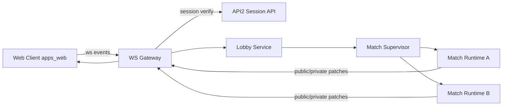
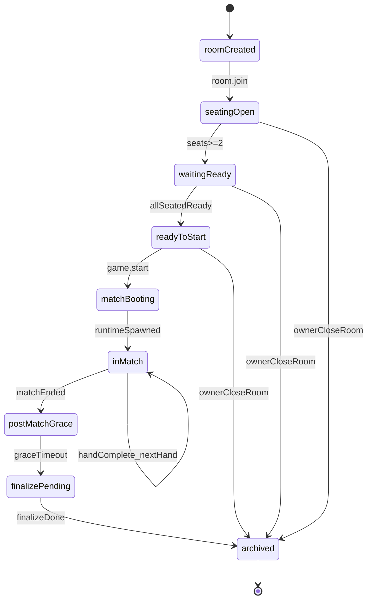
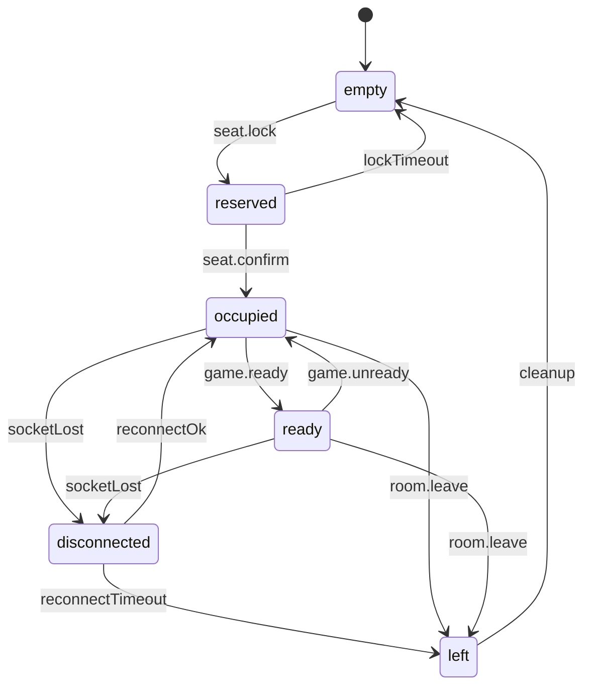
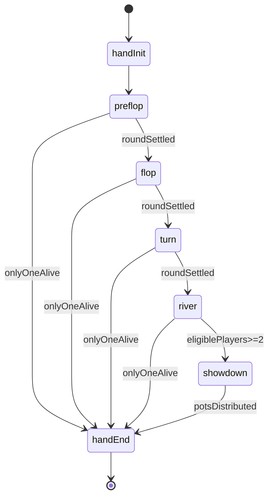
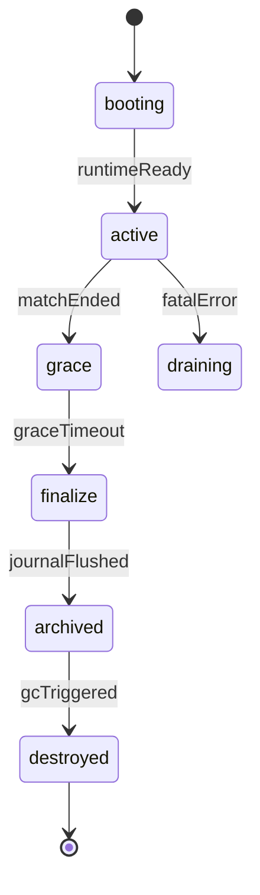
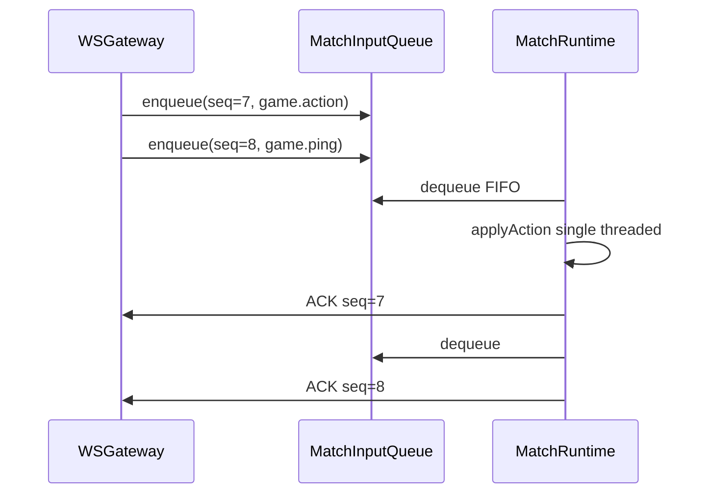
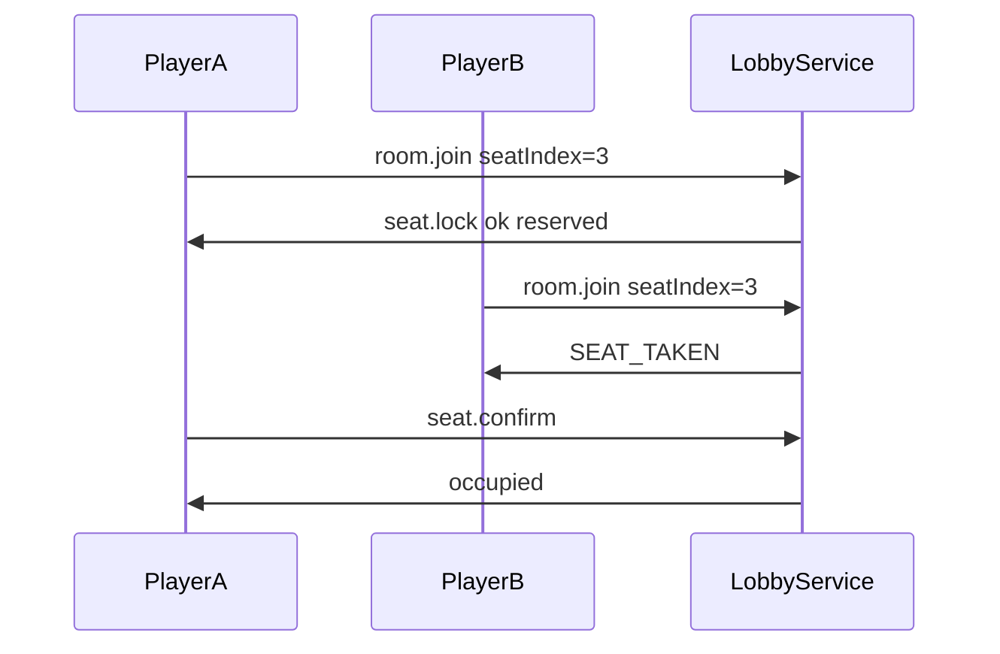
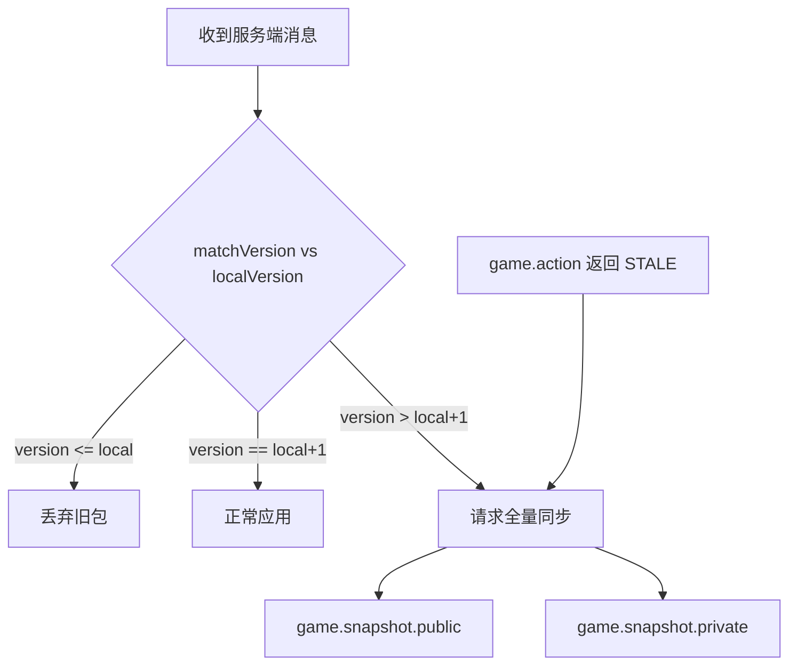

> 本文由首版工程计划改写为**落地纪要**：保留协议与状态机正文，文首给出相对初稿的产品决策与必须遵守的契约，便于对照代码联调。
>
> 体验入口：[德州扑克](/texas-holdem/) · 代码：`apps/poker-realtime` + `apps/web` · 部署：`npm run deploy:poker-realtime` / `deploy:web`

# 联机德州扑克实施计划与落地纪要

## 落地摘要（相对初稿）

首版已上线。相对「固定六人、纯计划」的初稿，实际产品边界如下：

| 维度 | 初稿 | 落地 |
| --- | --- | --- |
| 人数 | 固定 6 人 | **2–9 人**（`maxSeats=9`，座位布局随入座人数切换） |
| 凑桌 | 仅真人 | 房主 `room.addBot` / `room.removeBot`；对局中加入 → **下一手入局** |
| 进房 | 停在大厅文案 | **进房即牌桌**：座位与准备态可见；工具栏准备 / 开始 / 机器人 / 离开 |
| 分享 | 无 | `/texas-holdem/?room=房间码`，打开即可自动加入 |
| 多手 | 设计有 | `handEnd` 后约 **1.5s** 自动下一手；同 match 内 `matchVersion` **单调递增** |
| 会话 | 未细化 | 浏览器 `/api/me` 短时缓存；WS 握手后发 `session.ready`，再处理业务消息 |
| 实现语言 | 文中多写 `.ts` | 运行时为 **`.js` / `.mjs`** |

**交付对照**

- Phase 1–2：建房入房、权威发牌结算、边池、幂等、机器人 — **已上线**
- Phase 3：断线宽限、超时行动、多手、`sync.request` — **已上线**
- Phase 4：journal / replay、脱敏、限流 — **已具备**
- Phase 5：代理、测试与部署脚本、nginx `/ws/poker` — **已具备**

**明确不做**：观战、聊天、排行榜、充值/rebuy、Redis 多实例、commit-reveal 可验证公平。

### 核心契约（联调按此验收）

这些不是「补丁说明」，而是首版协议与产品边界的**硬约束**：

1. **版本作用域是 match，不是 hand**  
   `matchVersion` 在同一场对局内跨手连续递增；客户端用 `handId` / `handStarted` 界定新手，再用版本去重。把版本理解成「每手从 1 开始」会与水位语义冲突。

2. **房间可见性先于开局**  
   `room.create` / `room.join` 成功即进入牌桌视图，用 `room.snapshot` 渲染座位与准备态；不必等到 `inMatch`。

3. **身份查询与牌局命令解耦**  
   `/api/me` 只用于建立「我是谁」；大厅操作走已缓存的会话 + WS。服务端按 TTL / 行动次数复验即可，不必每个按钮打一次 HTTP。

4. **连接就绪先于业务请求**  
   客户端在收到 `session.ready` 之后再发 `room.create` / `room.join`；服务端在鉴权完成前缓冲或丢弃过早消息，避免握手半开窗口。

## 目标与边界

- 实现 **2–9 人联机房间**（真人 + 可选机器人），登录后才能建房/入房。
- 保持客户端仅负责渲染与输入，**牌局状态、发牌、行动合法性、边池与胜负结算全部由服务端权威裁决**。
- 已做可运行 MVP：房间制 + 单桌多手连续 + 基本重连 + 机器人；**不做**排行榜、观战、聊天。

## 架构方案（独立实时服务 + 状态隔离副本）

- 独立服务目录：`apps/poker-realtime`（Node.js + WebSocket）。
- `apps/web` 连接同源 `/ws/poker`；网关按房间/match 路由到对应牌局 runtime。
- 每局独立 `MatchRuntime`（进程内单线程串行队列）。
- 登录校验在 WS 握手完成（调用 `apps/api2` `/api/me`）；缓存会话 TTL，关键操作按策略轻量复验。
- 房间与牌局状态用**内存存储**；journal 落盘本地目录。不引入 Redis。



## 后端实施步骤

- 在 `apps/poker-realtime` 初始化服务骨架：
  - `src/server.ts`：启动 HTTP + WebSocket 网关。
  - `src/config.ts`：端口、CORS、`api2` 地址等配置。
  - `src/auth/session.ts`：握手验证登录态（调用 `api2`，失败则拒绝连接）。
  - `src/match/supervisor.ts`：副本创建、路由、回收。
  - `src/match/runtime.ts`：单局状态机（独立状态域）。
- 设计事件协议（请求/广播）与错误码：
  - 请求：`room.create`、`room.join`、`room.leave`、`room.addBot`、`room.removeBot`、`game.ready`、`game.start`、`game.endMatch`、`game.action`、`game.ping`、`session.reconnect`、`sync.request`。
  - 广播：`session.ready`、`room.snapshot`、`game.snapshot.public`、`game.snapshot.private`、`game.event`（含 `handStarted`/`handEnded`）、`game.error`、`session.kicked`。
  - 幂等字段：`clientActionId`、`handId`、`turnId`（同一动作重复提交必须返回同一结果且不重复扣筹码）。
  - 幂等主键采用 `(roomId, userId, handId, turnId, clientActionId)`，防跨手牌/回合重放。
  - `turnId` 必须单调递增并由服务端发放。
- 抽离服务端牌局引擎（从现有前端逻辑迁移）：
  - 复用思路并搬迁规则到服务端模块（参考 [apps/web/src/lib/pokerBetting.mjs](apps/web/src/lib/pokerBetting.mjs) 与 [apps/web/src/lib/pokerEngine.mjs](apps/web/src/lib/pokerEngine.mjs)）。
  - 增加权威回合机：行动窗口、超时自动弃牌、仅当前行动位可提交动作。
  - 边池与摊牌计算在服务端单点执行。
- 安全隔离：
  - 公共广播永不包含他人手牌；仅向对应连接下发私有手牌快照。
  - 错误消息不泄露他人隐藏信息。
  - `game.error`、管理端日志、trace dump 不允许出现他人手牌明文（统一脱敏/哈希）。
- 房间生命周期：
  - 房间码生成、座位最多 9、最少 2 人（可含 bot）且全员 ready 后房主可开局。
  - 开局时创建匹配副本；**对局中也可加入**，下一手入局。
  - 断线保留席位与短时重连（如 30s grace period）。
  - 牌局结束后进入短暂 grace/重连窗口，空闲超时后回收副本。
  - 回收分两阶段：`grace` 可恢复窗口 + `finalize` 最终清理窗口。
  - 在 `finalize` 前必须落盘单手事件日志与结算结果，副本回收后仍可查询。

## 前端实施步骤

- 页面 [apps/web/src/pages/texas-holdem.astro](apps/web/src/pages/texas-holdem.astro) + [MultiplayerTexasHoldemGame.astro](apps/web/src/components/MultiplayerTexasHoldemGame.astro)：
  - 大厅创建/加入；**进房即牌桌**渲染座位与准备态；工具栏准备/开始/加减机器人/离开。
  - URL：`/texas-holdem/?room=XXXXXX`，带参自动加入。
  - `socket state -> render`；操作仅发 `fold/call/raise/allin`。
- 网络层：`pokerSocket.ts`（等 `session.ready`、跨手版本水位）、`pokerProtocol.ts`。
- 开发代理：`astro.config.mjs` 中 `/ws/poker` → `:3003`。

## 工程与脚本接入

- 根脚本 [package.json](package.json)：
  - `dev:poker-realtime`、`start:poker-realtime`、`test:poker-realtime`、`deploy:poker-realtime`、`deploy:web`。

## 测试与验收

- 单元测试（实时服务）：
  - 行动合法性、轮转、边池、摊牌、异常输入保护。
  - 幂等：同一 `clientActionId` 重复发送 3 次，不重复扣筹码且返回一致。
  - 幂等防重放：跨 `handId` / `turnId` 重放同一 `clientActionId` 必须被拒绝。
- 集成测试：
  - 6 客户端同房间开局、关键操作广播一致性、断线重连恢复。
  - 副本回收：牌局结束后按空闲超时正确释放资源。
  - 网关到副本采用“单桌串行输入队列 + 顺序 ACK”，验证无并发 mutate。
- 前端验收：
  - 登录用户建房、他人加入、一手完整对局、多人 All-in 边池结果一致。
  - 安全隔离：进行中牌局无法从任何公共事件拿到他人手牌。
- 回放验收：
  - 保存单手事件日志后，可从空状态重建最终结算结果并与线上一致。
  - 日志至少包含：`deckSeed`、状态版本号、每个动作前后关键摘要（`pot`、各座位 `stack`、`currentBet`、`street`）。
- 稳定性基线（首版不做压测）：
  - 正确性优先：串行队列、幂等、重连契约、脱敏；事件延迟通过结构化日志可观测。

## 分阶段交付（状态）

- Phase 1：房间与连接 — **完成**
- Phase 2：服务端权威牌局 — **完成**
- Phase 3：重连、超时、多手、`stateVersion` — **完成**
- Phase 4：审计与限流 — **完成**
- Phase 5：联调与上线 — **完成**

## 新增强约束（本轮评审结论）

以下条目在后续「核心实现细则」章节展开为模块级设计与验收标准：

- **会话校验**：握手缓存 + `game.action` 轻量复验 + 强制踢线（防登出后仍可操作窗口）。
- **幂等防重放**：主键 `(roomId, userId, handId, turnId, clientActionId)`，`turnId` 服务端单调发放。
- **可审计回放**：事件源含 `deckSeed`、版本号、动作前后摘要，可证明边池争议一致。
- **副本串行语义**：网关↔runtime 单桌串行队列 + 顺序 ACK，禁止并发 mutate。
- **全通道脱敏**：`game.error`、管理日志、trace dump 均不得含他人手牌明文。
- **双阈值回收**：`grace` 可恢复 + `finalize` 落盘；`destroyed` 后仍可查询归档。
- **大厅边界**：座位锁、准备态、房主离开、抢座冲突等状态图与迁移规则。

## 状态机设计（实现前强约束）

### 大厅状态机（Room Lifecycle）



- **进入条件**
  - `roomCreated`: 房间创建成功，持有 `roomId` 与 `ownerId`。
  - `seatingOpen`: 允许加入与抢座，座位锁生效。
  - `waitingReady`: 至少 2 人入座后进入准备阶段。
  - `readyToStart`: 所有已入座玩家 `ready=true`。
- **关键约束**
  - 只有有效房主（含 `actingOwnerId` 代管）可 `game.start` / 加减机器人 / `game.endMatch`。
  - `inMatch` 期间**允许**新玩家占空座，本手旁观、**下一手入局**；重连仍绑定原席位。
  - **多手连续**：一手 `handEnd` 后约 1.5s，若仍有 >=2 名有效玩家且 match 未结束，自动下一手（`handComplete_nextHand`），庄位轮换。
  - match 结束条件：房主 `game.endMatch`、全员离桌、或仅剩 1 人无法继续。
  - `postMatchGrace` 期间允许结果查询与断线恢复，不允许新开局。
  - `archived` 后禁止状态回迁；仅允许读取归档信息。

### 座位状态机（Seat Lifecycle）



- **关键约束**
  - `reserved` 必须有超时回滚，防止卡座。
  - `disconnected` 期间保留玩家席位与手牌归属，不释放到 `empty`。
  - `left` / `leaveAfterHand`：对局中自愿离开可本手强制弃牌后离桌；断线走宽限重连。
  - 机器人座位：`isBot=true`，由房主增减；行动由 runtime 短延迟自动提交。

### 牌局状态机（Hand / Street FSM）



- **行动子状态（每条街内部）**
  - `awaitAction(turnId)` -> `applyAction` -> `broadcastVersion+1` -> `nextActorOrRoundEnd`。
  - 只有当前 `turnId` 的 `actor` 可提交动作；其他请求直接拒绝。
- **动作合法性**
  - `fold/call/raise/allin` 由服务端验证：回合、最小加注、筹码上限、幂等主键。
  - 同一 `(roomId,userId,handId,turnId,clientActionId)` 重复提交只返回第一次结果。
- **全下分支**
  - 若进入“无人可继续行动”但未到 `showdown`，自动 `runout board` 后结算。

### 副本生命周期状态机（Match Runtime）



- **关键约束**
  - `active` 阶段所有输入必须经“单桌串行队列”处理。
  - `finalize` 前强制落盘：事件日志、结算摘要、版本链校验值。
  - `archived` 后可查不可改；`destroyed` 仅释放内存与运行时资源。

## 状态机验收清单

- 覆盖每个状态机的**有效迁移**与**非法迁移拒绝**测试。
- 并发测试：同一时刻多动作请求只允许一个动作进入 `applyAction`。
- 重连测试：`disconnected -> reconnectOk` 保持席位与私有手牌可见性不变。
- 回收测试：`grace -> finalize -> archived -> destroyed` 全链路可观测且可查询归档。
- 多手测试：`handEnd` 后无需人工干预即可 `startHand`，且 `matchVersion` 大于上手结束值。

---

## 核心实现细则（评审补充；与文首契约一致）

### 1. 会话校验与强制踢线（高）

**问题**：仅在 WS 握手阶段校验 `api2` 会话并缓存 TTL，用户在 `api2` 登出或权限变更后，WS 侧可能继续接受 `game.action`。

**模块**：`apps/poker-realtime/src/auth/session.ts`、`src/auth/revalidation.ts`

**握手阶段（不变）**

- WS upgrade 时携带 cookie / bearer，调用 `GET {api2}/api/me`。
- 成功则写入 `SessionCache`：`{ userId, sessionToken, verifiedAt, actionCountSinceVerify }`。
- 失败拒绝连接，返回 `AUTH_REQUIRED`。

**轻量复验触发点（首版默认）**

| 触发时机    | 事件                      | 行为                                                                                     |
| ----------- | ------------------------- | ---------------------------------------------------------------------------------------- |
| 每手开始    | `handInit`                | 对该桌所有在线连接复验                                                                   |
| 每 N 次动作 | `game.action` 成功应用后  | `actionCountSinceVerify >= N` 时复验（默认 N=5，配置项 `SESSION_RECHECK_EVERY_ACTIONS`） |
| 敏感操作    | `room.join`, `game.start` | 立即复验                                                                                 |
| 定时兜底    | 后台 tick                 | `verifiedAt` 超过 `SESSION_CACHE_TTL_MS`（默认 5min）强制复验                            |

**复验实现**

- 轻量：再次 `GET /api/me`，比对 `userId` 一致且会话未撤销。
- 失败：返回 `SESSION_EXPIRED`，关闭该连接，向房间广播 `session.kicked { userId, reason }`。
- 对局中失败：座位转 `disconnected`，按托管策略处理，不阻塞全桌。

**强制踢线能力**

- 内部接口：`POST /internal/kick`（仅本机或 admin token）`{ userId, roomId?, reason }`。
- 网关查找该 `userId` 活跃 WS，发送 `session.kicked` 后 `close(4001)`。
- 日志记录 `kickReason`，供审计。

**配置项（`src/config.ts`）**

```ts
SESSION_CACHE_TTL_MS = 300_000;
SESSION_RECHECK_EVERY_ACTIONS = 5;
```

**验收**

- 用户在另一标签页登出后，第 N 次 `game.action` 或下一手开始时被拒绝并踢线。
- 强制踢线后同桌收到 `session.kicked`，被踢用户无法继续提交动作。

---

### 2. 幂等键上下文绑定（高）

**问题**：仅校验 `clientActionId` 时，跨 `handId`/`turnId` 重放可能被误判为合法重复。

**模块**：`apps/poker-realtime/src/match/idempotency.ts`

**幂等主键（字符串化）**

```
${roomId}:${userId}:${handId}:${turnId}:${clientActionId}
```

`**turnId` 发放规则\*\*

- 由 match runtime 在每次进入 `awaitAction(actorSeatId)` 时递增并广播。
- 客户端必须在 `game.action` 中回显当前服务端 `turnId`；不匹配返回 `STALE_TURN`。
- 动作被拒绝（非法加注等）不递增 `turnId`；成功应用后进入下一 actor 时递增。

**存储与生命周期**

- 内存 `Map<idempotencyKey, { result, appliedAt, matchVersion }>`，仅保留当前手牌。
- `handEnd` 时清空该 `handId` 下所有键。
- 重复提交同一键：返回 `IDEMPOTENT_REPLAY_OK` + 首次 `result`（含当时 `matchVersion`），**不二次扣筹码**。

**防重放矩阵**

| 场景                              | 预期                                        |
| --------------------------------- | ------------------------------------------- |
| 同键重复提交                      | `IDEMPOTENT_REPLAY_OK`，结果一致            |
| 同 `clientActionId` 不同 `turnId` | 新请求，按当前回合校验                      |
| 同 `clientActionId` 不同 `handId` | 新请求；若 turn 上下文不匹配则 `STALE_TURN` |
| 过期 `turnId`（< 当前）           | `STALE_TURN`                                |
| 未来 `turnId`（> 当前）           | `STALE_TURN`                                |

**验收**

- 同一动作连发 3 次：筹码只变动一次。
- 将上一手的 `clientActionId` 重放到新手：`STALE_TURN` 或 `INVALID_ACTION`，筹码不变。

---

### 3. 可审计事件源与边池争议回放（高）

**问题**：只记录动作序列无法证明边池/筹码中间态一致，线上争议无法复盘。

**原则**：日志是**可审计事件源**，不是调试打印；必须能从空状态重建并校验每一步中间态。

`**events.ndjson` 单行结构（示例）\*\*

```json
{
  "seq": 42,
  "handId": "h_abc",
  "matchVersion": 17,
  "turnId": 8,
  "eventType": "actionApplied",
  "actorUserId": "u1",
  "action": "raise",
  "amount": 200,
  "clientActionId": "ca_xyz",
  "deckSeedHash": "sha256:...",
  "before": {
    "street": "flop",
    "pot": 400,
    "currentBet": 100,
    "seats": [{ "seatId": 0, "stack": 900, "committed": 100 }]
  },
  "after": {
    "street": "flop",
    "pot": 400,
    "currentBet": 200,
    "seats": [{ "seatId": 0, "stack": 800, "committed": 200 }]
  },
  "sidePots": [{ "amount": 400, "eligibleSeatIds": [0, 1, 2] }],
  "serverTime": 1710000000123
}
```

**必须记录的事件类型**

- `handStarted`（含 `deckSeed` 仅存服务端/日志，对外仅 `deckSeedHash`）
- `actionApplied` / `actionRejected`
- `streetAdvanced`
- `sidePotCreated` / `sidePotUpdated`
- `showdown` / `settlement`

`**checkpoints.ndjson**`：每个 `matchVersion` 对应一条完整公开态摘要 + 各座 `stack/committed/status`（不含他人 holeCards）。

**离线重建（`src/journal/replay.ts`）**

1. 从 `handStarted` 加载 `deckSeed`，初始化引擎。
2. 按 `seq` 顺序重放 `actionApplied`，每步对比 `after` 与引擎产出。
3. 终态与 `settlement.json` 比对：`potsDistributed`、`finalStacks`、校验哈希。

**验收**

- 随机抽 10 手 All-in 边池局：`replay` 逐步 `before/after` 与引擎 100% 一致。
- 故意篡改一条 `events.ndjson`：`replay` 报告首个不一致的 `seq` 与字段。

---

### 4. Worker 消息边界与单桌串行语义（中）

**问题**：无论是否使用 `worker_threads`，网关与副本若并发投递多动作，会出现乱序 mutate。首版采用进程内 MatchRuntime + 单桌串行队列。

**模块**：`src/match/supervisor.ts`（路由）、`src/match/runtime.ts`（消费）、`src/match/queue-protocol.ts`

**架构约束**

- 一个 `matchId` 对应一个 worker / runtime 实例。
- **父线程（网关）只路由，永不直接修改牌局状态**。
- runtime 内**单线程事件循环**消费输入队列；禁止 `Promise.all` 并行处理多个 `game.action`。

**网关 → Runtime 消息信封**

```ts
type RuntimeInbound = {
  seq: number; // 网关对该 match 单调递增
  requestId: string;
  userId: string;
  type: string;
  payload: unknown;
  enqueuedAt: number;
};
```

**Runtime → 网关 ACK（顺序）**

```ts
type RuntimeAck = {
  seq: number; // 与 inbound.seq 一致
  requestId: string;
  ok: boolean;
  matchVersion?: number;
  error?: { code: string; retryable: boolean };
};
```

**处理流程**



- 网关为每个 `matchId` 维护 `nextSeq`；入队失败（worker 已 `draining`）立即 `MATCH_NOT_FOUND`。
- runtime 崩溃：supervisor 标记 `draining`，拒绝新 `seq`，grace 内仅允许查询/重连，不接收新动作。

**验收**

- 并发正确性：同一毫秒向同桌发送 10 个 `game.action`，仅 1 个成功应用，其余 `NOT_YOUR_TURN` 或排队顺序处理（单元/集成测试，非压测）。
- 日志中 `seq` 严格连续，无跳号 ACK。

---

### 5. 全通道信息隔离与脱敏（中）

**范围**：不止 S2C 公共广播；**所有出站与持久化通道**均需脱敏。

**模块**：`apps/poker-realtime/src/logging/sanitize.ts`

**脱敏规则**

| 通道                                  | 规则                                                                       |
| ------------------------------------- | -------------------------------------------------------------------------- |
| `game.snapshot.public` / `game.event` | 永不包含 `holeCards`；showdown 仅公开已亮牌                                |
| `game.error`                          | message 使用模板码（如 `INVALID_ACTION`），禁止拼接牌面                    |
| 应用日志 `logger.info/error`          | 经过 `sanitizeForLog(state)`，他人手牌替换为 `[REDACTED]` 或 `hash(cards)` |
| trace / debug dump                    | 仅允许 `deckSeedHash`、`holeCardsHashBySeatId`，禁止明文                   |
| 审计 `events.ndjson`                  | 可含完整 `deckSeed`（服务端受控存储），查询 API 对非参与者脱敏             |

**实现要点**

```ts
function sanitizeForLog(payload: unknown): unknown;
function hashHoleCards(cards: Card[]): string; // sha256(sorted card ids)
```

- 在 logger 中间件统一调用；开发环境可通过 `LOG_REDACT_OFF=true` 本地调试（默认 false）。

**验收**

- 扫描日志文件与 `game.error` 响应：无 `[Ah, Kd]` 类明文。
- 争议查询 API：非参与者看不到他人 `holeCards`，仅 `hash`。

---

### 6. 副本回收双阈值与落盘后可查询（中）

**问题**：回收后若未落盘，争议无法查；需区分「可恢复窗口」与「最终清理」。

**阶段与阈值（默认，可配置）**

| 阶段        | 触发                         | 内存/runtime     | 可接收动作 | 可查询             |
| ----------- | ---------------------------- | ---------------- | ---------- | ------------------ |
| `active`    | 对局进行中                   | 驻留             | 是         | 否（仅实时 WS）    |
| `grace`     | 对局结束 / 全员离桌          | 驻留             | 重连 only  | 否                 |
| `finalize`  | grace 超时（默认 30s）       | 驻留，停止新动作 | 否         | 落盘中             |
| `archived`  | journal flush 成功           | 可释放 worker    | 否         | **是（HTTP API）** |
| `destroyed` | archived 后 GC（默认 +5min） | 已销毁           | 否         | **是（仅磁盘）**   |

`**finalize` 落盘清单（阻塞离开 finalize）\*\*

1. 写完 `manifest.json`、`events.ndjson`、`checkpoints.ndjson`、`settlement.json`。
2. 写 `finalize.ok` 标记（含 `handIds[]`、`flushTime`、`contentHash`）。
3. 仅当全部成功才转 `archived`；失败重试 3 次后告警，保持 `finalize` 不销毁。

**查询保证**

- `destroyed` 后：`GET /api/poker/hand/:handId` 仍从 `data/poker-journal/...` 读取。
- 集成测试：副本 `destroyed` 后调用查询 API 返回 200。

---

### 7. 大厅座位锁与准备态边界（低，实现前必定义）

**模块**：`apps/poker-realtime/src/lobby/seat-lock.ts`、`src/lobby/room-fsm.ts`

**座位锁（防同时抢座）**

- `seat.lock`：`empty -> reserved`，绑定 `userId`，TTL 默认 **10s**（`SEAT_LOCK_TTL_MS`）。
- 同一 `seatIndex` 仅一个 `reserved`；他人请求返回 `SEAT_TAKEN`。
- `seat.confirm`：`reserved -> occupied`（仅锁持有者）。
- `lockTimeout`：`reserved -> empty`，释放座位。
- 同一用户同时只能持有一个 `reserved` 锁。

**准备态规则**

- `waitingReady`：至少 2 人 `occupied` 才进入。
- `readyToStart`：**所有已入座**玩家 `ready=true`（不是「半数」）；房主可 `game.start`。
- `game.unready`：任一玩家取消 ready，房间回 `waitingReady`。
- `game.start` 校验：`seatedCount >= minPlayers`（默认 2，配置 2~9）且全员 ready。

**房主离开边界**

| 房间状态                       | 房主 `room.leave` 行为                                                              |
| ------------------------------ | ----------------------------------------------------------------------------------- |
| `seatingOpen` / `waitingReady` | 转移 `ownerId` 给下一个 `occupied` 座位（按 seatIndex 最小）；若无他人则 `archived` |
| `readyToStart`                 | 同上；新房主可 `game.start`                                                         |
| `inMatch`                      | 房主视为 `disconnected` + 托管，不转移 owner 直到本手结束                           |
| `postMatchGrace`               | 同 `seatingOpen`                                                                    |

**「半数 ready 卡死」防护**

- 产品规则：未 ready 的玩家不阻塞他人练习——首版采用**全员 ready 才能开局**；UI 明确显示谁未 ready。
- 可选超时（非首版）：`READY_TIMEOUT_MS` 后自动 `unready` 该玩家或踢出；首版仅文档预留。

**抢座冲突时序**



**验收**

- 两人同时抢同一座：仅一人 `reserved`。
- 房主离开且另有玩家：owner 转移成功。
- 3 人入座 2 人 ready：`game.start` 返回 `NOT_ALL_READY`。

---

## 事件协议字段级契约（高优先级，实现前冻结）

### 通用信封（所有 C2S / S2C）

| 字段           | 类型         | 必填         | 说明                           |
| -------------- | ------------ | ------------ | ------------------------------ |
| `type`         | string       | 是           | 事件名                         |
| `requestId`    | string(uuid) | C2S 必填     | 客户端请求追踪；S2C 回显       |
| `roomId`       | string       | 视事件       | 房间上下文                     |
| `matchId`      | string       | 视事件       | 对局副本上下文                 |
| `stateVersion` | number       | S2C 快照必填 | 单调递增，从 1 起              |
| `serverTime`   | number(ms)   | S2C 建议     | 服务端时间戳                   |
| `error`        | object       | 失败时       | `{ code, message, retryable }` |

### C2S 请求契约

`**room.create**`

- 必填：`requestId`
- 权限：已登录用户
- 幂等：否（每次创建新房间）；可用 `requestId` 防双击重复建房（短窗口去重）
- 失败码：`AUTH_REQUIRED` / `RATE_LIMITED` / `ROOM_CREATE_FAILED`
- 可重试：`RATE_LIMITED` 可重试；其余不可

`**room.join**`

- 必填：`requestId`, `roomCode`, `seatIndex?`
- 权限：已登录用户
- 幂等：`(userId, roomId, requestId)` 短窗口去重
- 失败码：`ROOM_NOT_FOUND` / `ROOM_FULL` / `SEAT_TAKEN` / `ROOM_IN_MATCH` / `RATE_LIMITED`
- 可重试：`SEAT_TAKEN` 可换座重试；`RATE_LIMITED` 可重试

`**room.leave**`

- 必填：`requestId`, `roomId`
- 权限：房间内玩家
- 幂等：`(userId, roomId, requestId)`
- 失败码：`NOT_IN_ROOM` / `MATCH_LOCKED`
- 可重试：否

`**game.ready` / `game.unready**`

- 必填：`requestId`, `roomId`, `ready:boolean`
- 权限：已入座玩家
- 幂等：`(userId, roomId, requestId)`
- 失败码：`NOT_SEATED` / `ROOM_NOT_WAITING`
- 可重试：是（状态未变时返回当前 ready 状态）

`**game.start**`（房主）

- 必填：`requestId`, `roomId`
- 权限：`ownerId`
- 幂等：`(roomId, requestId)`；已开局则返回当前 `matchId`
- 失败码：`NOT_OWNER` / `NOT_ALL_READY` / `ALREADY_STARTED`
- 可重试：`NOT_ALL_READY` 可重试

`**game.action**`

- 必填：`requestId`, `roomId`, `matchId`, `handId`, `turnId`, `clientActionId`, `action`, `amount?`
- 权限：当前 `turnId` 对应 actor
- 幂等主键：`(roomId, userId, handId, turnId, clientActionId)`
- 失败码：`NOT_YOUR_TURN` / `INVALID_ACTION` / `INSUFFICIENT_STACK` / `STALE_TURN` / `STALE_VERSION` / `IDEMPOTENT_REPLAY_OK`
- 可重试：`IDEMPOTENT_REPLAY_OK` 返回首次结果；`STALE_TURN`/`STALE_VERSION` 需拉快照后重试

`**session.reconnect**`

- 必填：`requestId`, `roomId`, `matchId?`, `seatId`, `reconnectToken`
- 权限：绑定校验通过
- 幂等：`(userId, roomId, reconnectToken)`
- 失败码：`RECONNECT_EXPIRED` / `SEAT_MISMATCH` / `MATCH_NOT_FOUND`
- 可重试：`RECONNECT_EXPIRED` 不可；网络错误可重试

`**game.ping**`

- 必填：`requestId`
- 权限：已连接
- 幂等：是
- 失败码：无
- 可重试：是

### S2C 广播契约

`**room.snapshot**`

- 必填：`roomId`, `stateVersion`, `seats[]`, `roomState`
- 权限：房间内成员
- 不含：任何手牌

`**game.snapshot.public**`

- 必填：`matchId`, `handId`, `stateVersion`, `street`, `pot`, `community[]`, `seatsPublic[]`, `turnId`, `actorSeatId`
- 权限：房间内成员广播
- 不含：任何 `holeCards`

`**game.snapshot.private**`

- 必填：同上 + `holeCards[]`, `legalActions`, `raiseBounds`
- 权限：仅目标 `userId` 单播
- 不含：他人 `holeCards`

`**game.event**`

- 必填：`matchId`, `handId`, `stateVersion`, `eventType`, `payload`
- 用途：增量事件（actionApplied/showdown/settlement）
- 脱敏：payload 禁止他人手牌明文

`**game.error**`

- 必填：`requestId?`, `code`, `message`, `retryable`
- 脱敏：message 不得包含隐藏牌信息

### 统一错误码（首版最小集）

- `AUTH_REQUIRED`, `SESSION_EXPIRED`, `FORBIDDEN`
- `ROOM_NOT_FOUND`, `ROOM_FULL`, `SEAT_TAKEN`, `NOT_IN_ROOM`, `NOT_OWNER`
- `NOT_YOUR_TURN`, `INVALID_ACTION`, `INSUFFICIENT_STACK`, `STALE_TURN`, `STALE_VERSION`
- `IDEMPOTENT_REPLAY_OK`, `RECONNECT_EXPIRED`, `RATE_LIMITED`, `INTERNAL_ERROR`

---

## 状态版本与冲突处理规则（高优先级）

### `stateVersion` 递增规则

- 房间域与牌局域分别维护版本：`roomVersion`、`matchVersion`（避免混用）。
- 每次**状态变更**（入座、ready、动作应用、发街、结算）`matchVersion += 1`。
- **同一 match 内跨手不得把 `matchVersion` 重置为 1**；新手应从上手结束值继续递增（否则客户端会丢弃新手快照）。
- `turnId` 仅在“轮到新行动者”时递增；动作被拒绝不递增。
- 所有 `snapshot` 与 `game.event` 必须携带当前 `matchVersion` / `handId`。

### 客户端冲突处理策略



1. 收到 `matchVersion < localVersion`：丢弃（旧包）；`== local` 的 public/event 去重。
2. 收到 `matchVersion == localVersion + 1`：正常应用。
3. 收到 `matchVersion > localVersion + 1`：请求全量同步（`sync.request`），仍接受较新快照以便追赶。
4. **`handId` 变化或 `eventType=handStarted`**：按新手重置本地水位后再比较版本（版本作用域是 match，手界用 `handId` 划分）。
5. 本地提交若返回 `STALE_TURN`/`STALE_VERSION`：停乐观更新，拉全量快照。
6. 禁止客户端本地推进 pot/stack/street，仅以服务端快照为准。

---

## 断线重连：会话与座位绑定细则（高优先级）

### 绑定键与令牌

- 入座成功后服务端签发 `reconnectToken`（`crypto.randomBytes(32)` 编码，TTL 默认 30 分钟）。
- 绑定主键：`(userId, roomId, seatId, matchId)`。
- 重连必须同时满足：
  - WS 握手鉴权通过（`api2` 会话有效）
  - `reconnectToken` 未过期
  - `seatId` 仍属于该 `userId` 且状态为 `disconnected|occupied|ready`

### 重连推送顺序（固定）

1. `session.reconnect` ACK（含当前 `matchVersion`、`turnId`、`reconnectToken` 续期）
2. `game.snapshot.public`（全桌公开状态）
3. `game.snapshot.private`（仅本人手牌与合法动作）
4. 若 `matchVersion` 落后，补发最近 N 条 `game.event`（可选，默认关闭，优先全量快照）

### 重连失败处理

- `RECONNECT_EXPIRED`：座位进入 `sitout`（按房间策略），客户端回大厅。
- 对局中重连超时：按“托管弃牌/过牌”策略执行，避免阻塞全桌。

---

## 审计日志落盘模型与查询接口（高优先级）

### 存储模型（首版文件型，后续可迁 DB）

目录：`data/poker-journal/{roomId}/{matchId}/{handId}/`

| 文件                 | 内容                                                          | 索引键                               |
| -------------------- | ------------------------------------------------------------- | ------------------------------------ |
| `manifest.json`      | 房间元数据、参与者、开局/finalize 时间                        | `handId`, `roomId`, `matchId`        |
| `events.ndjson`      | 按时间追加事件（动作、状态迁移、结算）                        | `turnId`, `clientActionId`, `userId` |
| `checkpoints.ndjson` | 每个动作前后摘要（pot/stacks/currentBet/street/matchVersion） | `matchVersion`                       |
| `settlement.json`    | 最终分配结果与校验哈希                                        | `handId`                             |

保留期：

- 热数据 30 天可在线查询
- 冷归档 180 天（可配置）

### 查询 API（HTTP，挂载于 `apps/poker-realtime`）

- `GET /api/poker/hand/:handId`：返回 `settlement.json` + 摘要
- `GET /api/poker/hand/:handId/events?cursor=&limit=`：分页读取 `events.ndjson`
- `GET /api/poker/hand/:handId/replay`：触发离线重建并返回比对结果（`rebuilt == settlement`）
- 权限：
  - 参与者可查自己参与过的 `handId`（校验 `userId` 在 manifest 中）
  - 管理员可查全部（后续接 admin 角色）

验收：副本 `destroyed` 后上述查询仍可用（证明 finalize 落盘成功）。

---

## 限流与滥用防护（中优先级，首版即启用）

### 限流维度

- 按 `userId`：全局连接与动作频率
- 按 `roomId`：房间 join 频率
- 按 `ip`（网关层）：防爆破房间码

### 建议阈值（可配置，写入 `src/config.ts`）

| 事件                | 阈值               | 超限响应       |
| ------------------- | ------------------ | -------------- |
| `room.create`       | 5 次/小时/用户     | `RATE_LIMITED` |
| `room.join`         | 10 次/分钟/用户    | `RATE_LIMITED` |
| `game.action`       | 30 次/分钟/用户    | `RATE_LIMITED` |
| `session.reconnect` | 20 次/10 分钟/用户 | `RATE_LIMITED` |

### 封禁策略

- 短时超限：返回 `RATE_LIMITED`（`retryable=true`），带 `Retry-After` 秒数
- 持续恶意（同一用户 5 分钟内触发 3 次限流）：写入 `abuseFlag`，临时封禁 15~60 分钟
- 封禁期间拒绝 `game.action` 与 `room.join`，允许只读查询与 `session.reconnect`（防止误封无法恢复）

---

## 公平性声明与随机源策略（中优先级）

### 首版策略（MVP）

- RNG 来源：`crypto.randomBytes` 派生 `deckSeed`（每手独立）。
- `deckSeed` 生命周期：仅存在于 match runtime 内存 + 审计日志；不对客户端公开实时 seed。
- 洗牌实现：确定性 PRNG（seed 可复现）+ Fisher-Yates。
- 手牌结束后可在 `settlement` 查询接口提供 `deckSeedHash`（`sha256(deckSeed)`）用于事后审计。

### 后续扩展（非首版，协议预留字段）

- 可验证公平（commit-reveal）：
  - 开局前广播 `seedCommit`
  - 结算后公开 `seedReveal`
  - 客户端可验证 `hash(seedReveal) == seedCommit`
- 首版不阻塞上线，但 `manifest.json` 与 `settlement.json` 预留 `seedCommit`/`seedReveal` 字段位。

---

## 协议与运维验收补充

- 协议契约测试：每个事件至少 1 条“成功路径 + 失败路径 + 幂等路径”用例。
- 版本冲突测试：人为注入乱序包，客户端必须触发全量同步且不出现 UI 状态倒退。
- 重连测试：断线 5s/30s/超时三档，验证绑定与推送顺序一致。
- 审计测试：随机抽 10 手，`replay` 结果与 `settlement` 100% 一致；篡改日志可定位首个不一致 `seq`。
- 限流测试：超限返回 `RATE_LIMITED`，不影响同桌其他玩家正常行动。
- RNG 测试：同一 `deckSeed` 重建牌序与线上一致；`deckSeedHash` 可校验。
- **会话复验测试**：api2 登出后 WS 在复验点被拒绝；强制踢线 API 生效。
- **串行队列测试**：并发 `game.action` 仅顺序应用；`seq`/ACK 连续无跳号。
- **脱敏测试**：日志与 `game.error` 无手牌明文；查询 API 权限隔离。
- **回收测试**：`destroyed` 后 HTTP 查询仍 200；`finalize.ok` 存在才转 `archived`。
- **大厅边界测试**：抢座冲突、房主转移、未全员 ready 无法开局。
- **多手连续测试**：连续 3 手庄位正确轮换；中间有人离桌 match 正确处理。
- **行动超时测试**：超时自动 fold/check；重连后计时器状态正确。
- **双连接测试**：同 userId 新连接踢旧，旧连接收到 `session.kicked` 且无法 action。

---

## Review 缺口补充（第三轮，已确认决策）

### 已确认的产品决策

| 决策           | 选择         | 影响                                                       |
| -------------- | ------------ | ---------------------------------------------------------- |
| Match 生命周期 | **多手连续** | 同一 match 内可打多手，庄位轮换，直到结束条件触发          |
| 双连接策略     | **踢旧保新** | 同 userId 新 WS 连接时，旧连接收到 `session.kicked` 后关闭 |

### A. 多手连续对局（高，已确认）

**模块**：`src/match/hand-loop.ts`、`src/match/runtime.ts`

**一手结束 → 下一手流程**

1. `handEnd`：落盘该手 journal（异步，不阻塞下一手准备）。
2. 检查 match 结束条件：`activePlayers < 2` 或 `owner.endMatch` 或全员 `left`。
3. 若继续：约 1.5s 后轮换 button，生成新 `handId`，`handInit`（`matchVersion` 从上手继续递增）。
4. 广播 `game.event { eventType: "handEnded" }`，随后 `handStarted` + public/private snapshot。
5. 每手独立 `deckSeed`、独立幂等键域、新 `handId`。

**Match 结束 → 回收**

- 触发 `postMatchGrace`（默认 30s）→ `finalize` 落盘全部 handIds → `archived`。

**新增 C2S 事件**

- `game.endMatch`（房主）：结束当前 match，不再发下一手。

**庄位 / 盲注（与本地版对齐）**

- 起始筹码：**500**；SB=**5**，BB=**10**（配置项 `TABLE_START_STACK`, `SB`, `BB`）。
- 庄位每手顺时针轮换；heads-up 时 button 即 SB。
- 短加注锁定（`raiseLockedIds`）：本街已对当前 raise 行动过的玩家，若 facing 更高 raise 则不可再 raise（仅 call/fold/allin），与本地组件一致。

**边池与 uncalled bet**

- 服务端必须使用 `settleUncalledBets`（本地组件未用，但 `pokerBetting.mjs` 已有）。
- 摊牌奇数筹码归庄位左侧（本地规则）。

---

### B. 行动超时与托管策略（高）

**模块**：`src/match/action-timer.ts`

| 参数                          | 默认值 | 说明                       |
| ----------------------------- | ------ | -------------------------- |
| `ACTION_TIMEOUT_MS`           | 30_000 | 轮到你行动的最长等待       |
| `DISCONNECT_GRACE_MS`         | 30_000 | 断线后仍可重连的窗口       |
| `RECONNECT_ACTION_TIMEOUT_MS` | 15_000 | 重连后若仍轮到你，缩短超时 |

**超时行为**

- 若 `callAmount === 0`（可 check）：自动 **check**。
- 若 `callAmount > 0`：自动 **fold**。
- 超时动作写入 `events.ndjson`（`eventType: "autoAction"`，`reason: "timeout"`）。
- 托管不递增 `turnId` 以外的客户端字段；`clientActionId` 由服务端生成 `auto_${turnId}`。

**计时器规则**

- 进入 `awaitAction(turnId)` 时启动；收到合法 `game.action` 或 autoAction 后清除。
- 断线转 `disconnected` 不暂停计时（防恶意挂机）；重连成功若仍轮到该玩家，恢复剩余时间或取 `RECONNECT_ACTION_TIMEOUT_MS` 较小值。

---

### C. WS 传输层与 Better Auth 集成（高）

**模块**：`src/ws/gateway.ts`、`src/auth/session.ts`

**鉴权路径（与 api2 对齐）**

- 客户端 WS URL：`ws://127.0.0.1:4321/ws/poker`（dev，经 Astro 代理）或生产同源路径。
- Upgrade 请求携带 Better Auth **httpOnly cookie**（与 `/api/me` 相同）。
- `poker-realtime` 握手时：`fetch('http://127.0.0.1:3002/api/me', { headers: { cookie } })` 或内网调用 Better Auth `getSession`。
- **不用** bearer token 首版；与现有 `auth-client.ts` 同源策略一致。

**心跳与断线检测**

| 参数                    | 值                          |
| ----------------------- | --------------------------- |
| 客户端 `game.ping` 间隔 | 15s                         |
| 服务端 pong 超时        | 45s 无 ping 则 `socketLost` |
| 最大消息体              | 8KB                         |
| 单用户最大并发 WS       | 1（踢旧保新）               |

**双连接踢旧流程**

1. 新连接握手成功，查 `ConnectionRegistry[userId]`。
2. 若已有旧连接：向旧连接发 `session.kicked { reason: "duplicate_connection" }`，`close(4002)`。
3. 注册新连接；旧连接的 `game.action` 立即失效。

**Dev 代理（`astro.config.mjs`）**

```js
'/ws/poker': { target: 'ws://127.0.0.1:3003', ws: true }
```

**生产 nginx**：见 [`deploy/poker-realtime-nginx-snippet.conf`](/deploy/poker-realtime-nginx-snippet.conf)（`/ws/poker` Upgrade + `/api/poker`）。

---

### D. 协议遗漏事件补全（高）

**新增 C2S**

- `sync.request`：必填 `roomId`, `matchId`, `lastKnownVersion`；权限：房间内玩家；失败码：`STALE_VERSION`；可重试：是。
- `game.endMatch`：必填 `requestId`, `roomId`；权限：房主；失败码：`NOT_OWNER` / `NOT_IN_MATCH`。

**新增 S2C**

- `session.kicked`：必填 `userId`, `reason`；权限：目标连接。
- `game.handStarted` / `game.handEnded`：多手切换广播。

**协议版本**

- 通用信封增加 `protocolVersion: 1`（首版固定 1，后续不兼容变更递增）。

---

### E. 共享引擎与代码组织（中）

**推荐结构（首版）**

```
packages/poker-core/          # 新建共享包（或 apps/poker-realtime/src/core/ 复制起步）
  pokerEngine.mjs             # 从 apps/web 迁入
  pokerBetting.mjs
  index.mjs
apps/poker-realtime/          # 服务端状态机 + WS
apps/web/                     # 仅 UI，import poker-core 用于类型/测试对齐（可选）
```

- 服务端 `runtime.ts` 调用 `poker-core`；禁止在 worker 外 mutate 状态。
- 迁移时补齐：`settleUncalledBets`、服务端 `createDeck(deckSeed)` 替代客户端洗牌。

---

### F. 房间码与配置（中）

**房间码**

- 格式：6 位大写字母数字（不含易混淆字符 0/O/1/I），如 `AB3K9M`。
- 碰撞：查重后重试，最多 3 次。
- TTL：空房间 24h 无活动自动 `archived`。

**环境变量清单（`apps/poker-realtime/.env.example`）**

```
PORT=3003
API2_BASE_URL=http://127.0.0.1:3002
JOURNAL_DIR=./data/poker-journal
SESSION_RECHECK_EVERY_ACTIONS=5
ACTION_TIMEOUT_MS=30000
TABLE_START_STACK=500
SB=5
BB=10
INTERNAL_ADMIN_TOKEN=...   # /internal/kick 鉴权
```

---

### G. 可观测性与运维基线（中，首版最小集）

**模块**：`src/health.ts`、`src/metrics.ts`

- `GET /healthz`：返回 `{ ok, activeRooms, activeMatches, uptime }`。
- 结构化日志：JSON 行，字段 `roomId`, `matchId`, `handId`, `userId`, `event`, `latencyMs`（经 sanitize）。
- 关键告警（日志级，首版不做 Prometheus）：`finalize` 落盘失败、worker 崩溃、`replay` 校验不一致。

---

### H. 仍明确排除（首版不做）

- 观战、聊天、排行榜、筹码充值/rebuy
- Redis / 多实例横向扩展（首版明确不做）
- 大规模压测（首版明确不做；联调以正确性与契约测试为准）
- commit-reveal 可验证公平（仅预留字段）
- 跨房间匹配/快速加入

---

### I. Review 结论 → 落地结论

| 维度     | 状态   | 说明 |
| -------- | ------ | ---- |
| 协议契约 | 已上线 | 含 bot、多手事件、`session.ready`、`sync.request` |
| 状态机   | 已上线 | 多手连续 + 对局中入座下手入局 |
| 安全     | 已上线 | 会话复验、脱敏、限流 |
| 审计     | 已具备 | journal + replay |
| 前端体验 | 已上线 | 进房即牌桌、`?room=`、会话缓存、match 级版本水位 |
| 运维     | 已具备 | health、部署脚本；发布回滚仍靠手动 |

**文首「落地摘要 / 核心契约」是当前产品真相**；后文细则作协议与状态机参考，冲突时以前者为准。
